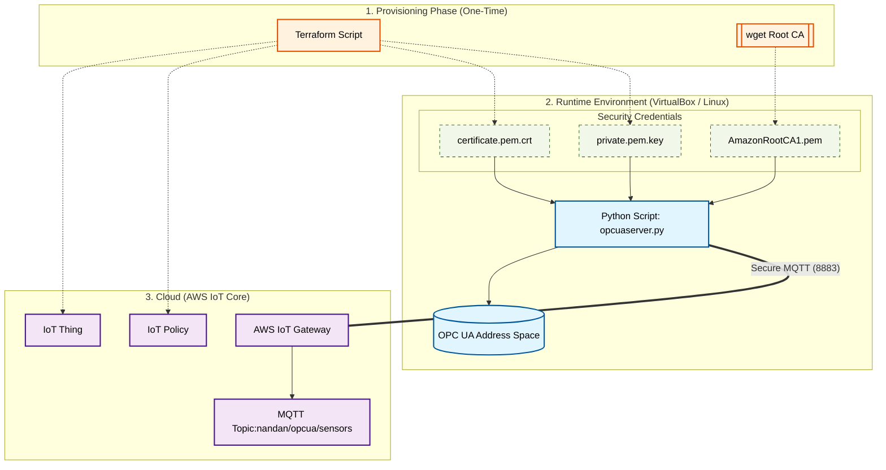

# Python OPC UA to AWS IoT Core

This project runs an OPC UA Server that generates 4 random sensor nodes and 
optionally publishes the data to AWS IoT Core.

## Setup
1. Create a virtual environment: `python3 -m venv venv`
2. Activate: `source venv/bin/activate`
3. Install dependencies: `pip install -r requirements.txt`

## Usage
- Set `ENABLE_AWS = True` in `server.py` to enable cloud publishing.
- Run the server: `python opcserver.py`

## Infrastructure Provisioning
This project uses **Terraform** to automate the creation of AWS IoT Core resources.

### Prerequisites
1.  **AWS CLI** configured with valid credentials.
2.  **Terraform** installed on your machine.

### Setup Steps
1.  **Provision AWS Resources:**
    ```bash
    terraform init
    terraform apply -auto-approve
    ```
    *This will generate `certificate.pem.crt` and `private.pem.key` in the project root.*

2.  **Download Amazon Root CA:**
    The AWS IoT Python SDK requires the Root CA to verify the server identity.
    ```bash
    wget [https://www.amazontrust.com/repository/AmazonRootCA1.pem](https://www.amazontrust.com/repository/AmazonRootCA1.pem)
    ```

3.  **Run the Bridge:**
    ```bash
    python opcuaserver.py
    ```

### Resources Managed by Terraform
* `aws_iot_thing`: The logical representation of the OPC UA - AWS IoT Core.
* `aws_iot_certificate`: The hardware-level security identity.
* `aws_iot_policy`: Grants `iot:Connect` and `iot:Publish` permissions.
* `local_file`: Automatically exports the keys to the local directory for Python.

### AWS IoT Console Output


### OPC UA Server Execution


### OPC UA Publish Data to AWS IoTCore


## Architecture


