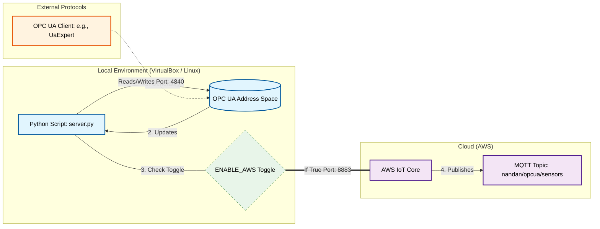

# Python OPC UA to AWS IoT Core

This project runs an OPC UA Server that generates 4 random sensor nodes and 
optionally publishes the data to AWS IoT Core.

## Setup
1. Create a virtual environment: `python3 -m venv venv`
2. Activate: `source venv/bin/activate`
3. Install dependencies: `pip install -r requirements.txt`

## Usage
- Set `ENABLE_AWS = True` in `server.py` to enable cloud publishing.
- Run the server: `python opcserver.py`

## Architecture

