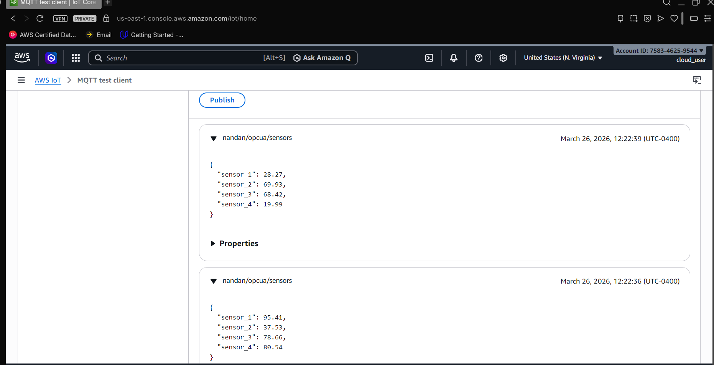
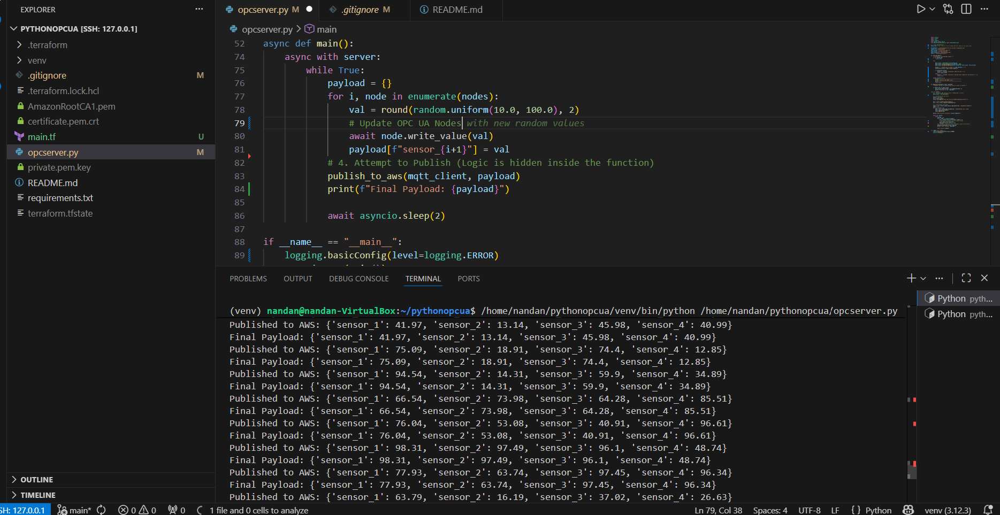
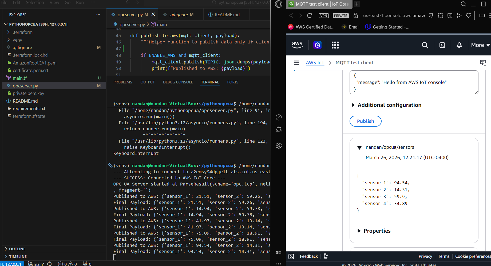
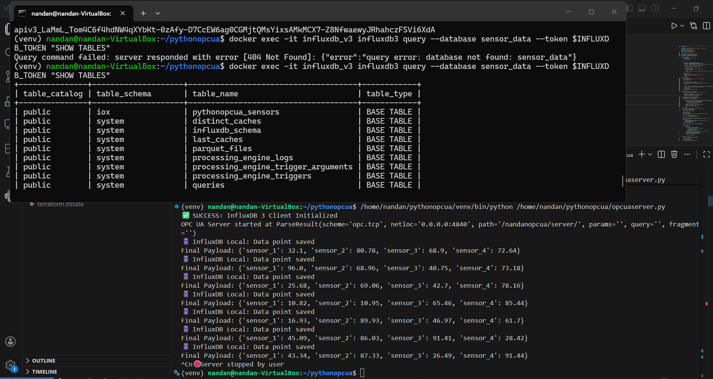
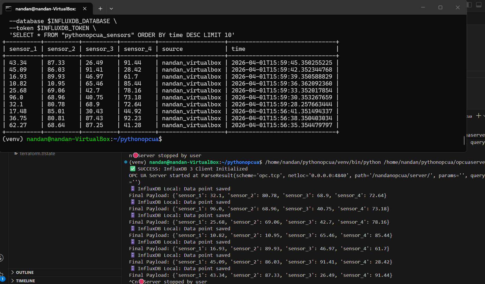
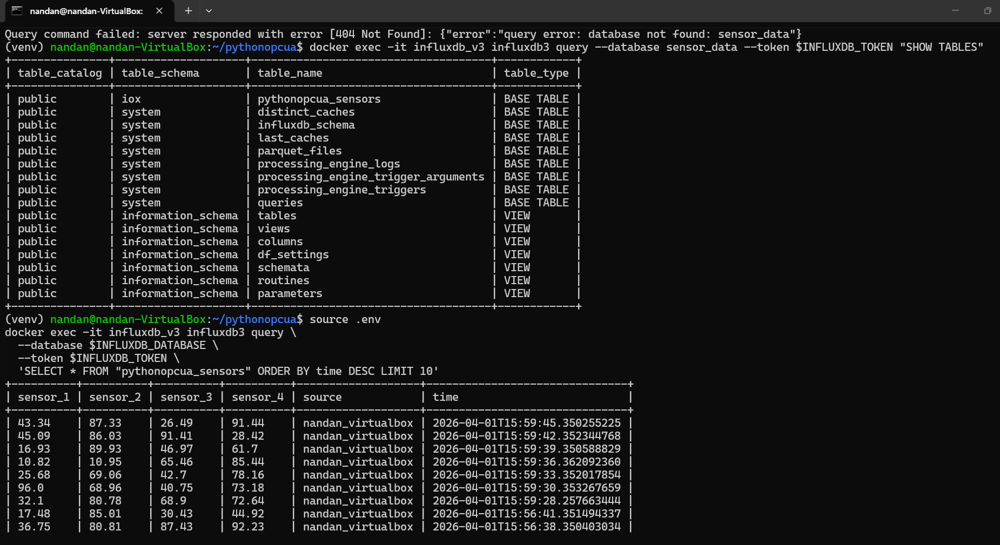
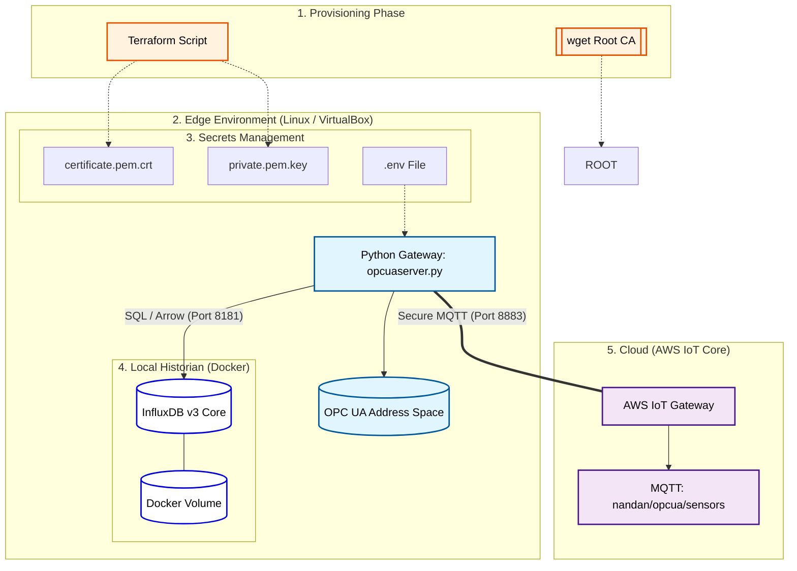

# Python OPC UA to AWS IoT Core and InfluxDB V3

This project runs an OPC UA Server that generates 4 random sensor nodes and 
optionally publishes the data to AWS IoT Core. The same data is being stored in InfluxDB V3

## Setup
1. Create a virtual environment: `python3 -m venv venv`
2. Activate: `source venv/bin/activate`
3. Install dependencies: `pip install -r requirements.txt`

## Usage
- Set `ENABLE_AWS = True` in `server.py` to enable cloud publishing.
- Run the server: `python opcserver.py`

## Infrastructure Provisioning
This project uses **Terraform** to automate the creation of AWS IoT Core resources.

### Prerequisites
1.  **AWS CLI** configured with valid credentials.
2.  **Terraform** installed on your machine.

### Setup Steps
1.  **Provision AWS Resources:**
    ```bash
    terraform init
    terraform apply -auto-approve
    ```
    *This will generate `certificate.pem.crt` and `private.pem.key` in the project root.*

2.  **Download Amazon Root CA:**
    The AWS IoT Python SDK requires the Root CA to verify the server identity.
    ```bash
    wget [https://www.amazontrust.com/repository/AmazonRootCA1.pem](https://www.amazontrust.com/repository/AmazonRootCA1.pem)
    ```

3.  **Run the Bridge:**
    ```bash
    python opcuaserver.py
    ```

### Resources Managed by Terraform
* `aws_iot_thing`: The logical representation of the OPC UA - AWS IoT Core.
* `aws_iot_certificate`: The hardware-level security identity.
* `aws_iot_policy`: Grants `iot:Connect` and `iot:Publish` permissions.
* `local_file`: Automatically exports the keys to the local directory for Python.

### AWS IoT Console Output


### OPC UA Server Execution


### OPC UA Publish Data to AWS IoTCore


## Local Historian (InfluxDB v3)
- This project implements a local high-performance historian using InfluxDB 3 Core, ensuring data persistence and local analytics even during network outages.
- Containerized Deployment: Orchestrated via docker-compose to provide a zero-install, reproducible environment for the Apache Arrow-powered InfluxDB 3 engine.
- High-Performance Storage: Leverages the IOx engine for high-speed data ingestion and compression, optimized for time-series telemetry.
- Security & Auth: Implemented a Token-based authentication layer managed via .env to secure the local API and CLI access.
- Storage Persistence: Configured Docker volumes (influxdb3_data) to prevent data loss during container updates or host reboots.




## Data Ingestion & Dual-Write Strategy
- The gateway is engineered to perform a Synchronous Dual-Write, distributing data to two distinct sinks:
- Local Sink (InfluxDB): Real-time SQL-native storage for high-frequency edge analytics and debugging.
- Cloud Sink (AWS IoT Core): Secure MQTT-based telemetry for global monitoring, long-term cold storage, and cloud-native alerts.
- Unified Schema: Standardized the ingestion format using InfluxDB Measurements and Tags:
	- Measurement: pythonopcua_sensors
	- Tags: source (e.g., nandan_virtualbox) to allow multi-asset filtering in SQL queries.
	- Fields: Dynamic mapping of OPC UA Node values to Float64 fields.





## Architecture


